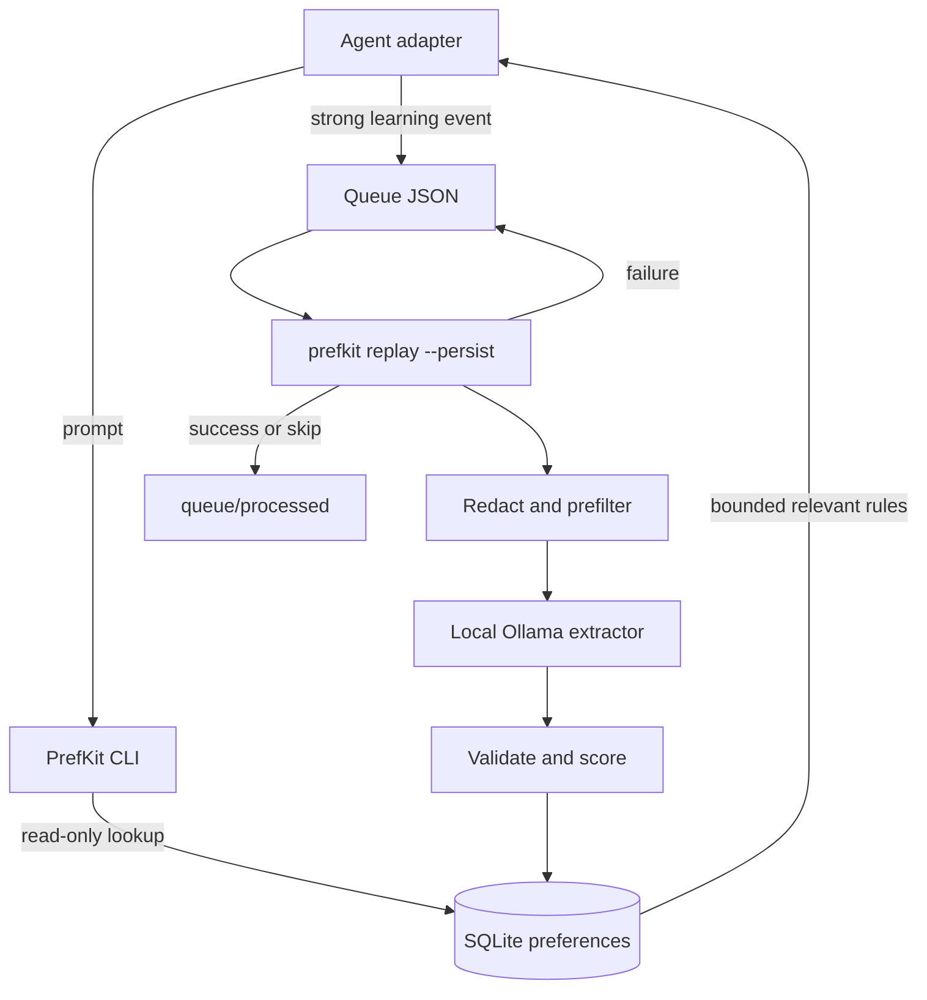

# PrefKit

PrefKit is a local-first preference memory layer for coding agents. It stores durable working preferences in SQLite, keeps provenance, retrieves only relevant preferences for a task, and can learn candidate preferences from redacted agent events through a local model.

The current implementation supports:

- manual preference storage
- provenance inspection
- status changes with `pin` and `forget`
- deterministic preference retrieval and context rendering
- local Ollama structured JSON extraction
- redaction before model calls
- deterministic signal gating and confidence scoring
- single-event learning with optional persistence
- queue replay for adapter-produced event files
- reviewable contradiction candidates and supersession links
- OpenCode context injection and learner event queueing

The OpenCode adapter is available now; Claude Code, Codex, and MCP adapters are planned. The core package is intentionally adapter-agnostic.

## Architecture



| Part | Responsibility | Model call |
| --- | --- | --- |
| Adapter | Connects an agent CLI to PrefKit hooks | No |
| CLI and core | Retrieve, render, store, review, and replay | Only during learning |
| SQLite | Preferences, evidence, status, and provenance | No |
| Ollama | Extracts one candidate preference from redacted evidence | Local only by default |

```text
~/.prefkit/
  prefs.db              preferences and evidence
  queue/*.json          pending events and retryable failures
  queue/processed/*.json  successfully handled events
```

### OpenCode request flow

```text
user prompt
  -> chat.message captures the prompt
  -> prefkit context searches SQLite and renders bounded context
  -> OpenCode model-message transform appends that context
  -> model answers with the preference available
```

### Learning and review flow

```text
strong prompt/correction
  -> queue/<event>.json
  -> replay --persist
  -> redact -> signal gate -> Ollama JSON -> schema validation -> confidence score
  -> candidate/active preference + evidence in SQLite
  -> contradiction candidate: prefkit why <id> -> prefkit review <id> --accept|--reject
```

## Install

```bash
pnpm install
pnpm typecheck
pnpm test
pnpm build
```

Initialize the local store:

```bash
pnpm prefkit init
```

By default the store is `~/.prefkit/prefs.db`.

For a published installation, install the CLI globally:

```bash
npm install --global @prefkit/cli
prefkit init
```

The repository commands below use `pnpm prefkit` for local development. The OpenCode plugin uses the installed `prefkit` executable after the packages are published.

For isolated checks, use a temporary store:

```bash
export PREFKIT_STORE="/tmp/prefkit-check.db"
pnpm prefkit init
```

## Configuration

PrefKit loads configuration from:

1. `--config path`
2. `PREFKIT_CONFIG`
3. `.prefkit.json` in the current directory
4. `~/.config/prefkit/config.json`
5. environment variables

Useful environment variables:

```bash
PREFKIT_STORE=~/.prefkit/prefs.db
PREFKIT_LEARNER=local
PREFKIT_OLLAMA_BASE_URL=http://127.0.0.1:11434
PREFKIT_OLLAMA_MODEL=qwen3:4b
PREFKIT_MODEL_TEMPERATURE=0
PREFKIT_MODEL_TIMEOUT_MS=20000
PREFKIT_REDACT_SECRETS=true
```

See [.prefkit.example.json](.prefkit.example.json) for all supported settings.

## Doctor

```bash
pnpm prefkit doctor
```

`doctor` checks config loading, store availability, and local Ollama reachability. A model failure should be clean and should not break storage or retrieval commands.

If Ollama runs on another machine, expose Ollama there and point PrefKit at it:

```bash
export PREFKIT_OLLAMA_BASE_URL="http://<host>:11434"
export PREFKIT_OLLAMA_MODEL="qwen3:8b-q4_K_M"
pnpm prefkit doctor
```

Ollama remote serving is controlled by Ollama's `OLLAMA_HOST` setting on the server machine.

For OpenCode adapter setup:

```bash
pnpm prefkit opencode install
pnpm prefkit opencode install --write
pnpm prefkit opencode doctor
pnpm prefkit opencode doctor --opencode-config ./opencode.jsonc
```

The install command prints a config snippet by default. With `--write`, it creates `.opencode/opencode.jsonc` only when a local OpenCode config does not already exist. The doctor checks supported config locations, `.opencode/plugins/` discovery, PrefKit plugin options, local adapter paths, and the queue directory that adapter-captured events will use.

## Manual Preferences

Add a preference:

```bash
pnpm prefkit remember "Prefer pnpm for JavaScript package management." --category tooling --tag javascript --tag package-manager
```

List preferences:

```bash
pnpm prefkit list
pnpm prefkit list --all
```

Inspect provenance:

```bash
pnpm prefkit why <pref_id>
```

Pin or suppress a preference:

```bash
pnpm prefkit pin <pref_id>
pnpm prefkit forget <pref_id>
```

Review a candidate produced by learning:

```bash
pnpm prefkit list --status candidate
pnpm prefkit why <pref_id>
pnpm prefkit review <pref_id> --accept
pnpm prefkit review <pref_id> --reject
```

Accepting a candidate with a supersession link activates it and marks the older preference as `superseded`. Rejecting it keeps the older preference unchanged.

Export:

```bash
pnpm prefkit export --format markdown
```

## Context Retrieval

`prefkit context` is deterministic and read-only. It does not call a model.

```bash
pnpm prefkit context --prompt "I need to name an app"
pnpm prefkit context --prompt "I need to name an app" --why
pnpm prefkit context --prompt "I need a testing strategy" --limit 3 --min-confidence 0.6
```

Retrieval uses SQLite FTS plus lexical fallback, scope filtering, confidence filtering, and a token-bounded renderer. It is designed to inject a small set of relevant preferences, not the whole memory database.

## Learning

Learning uses a local model as an extractor, not as the authority.

Flow:

```text
event JSON
  -> validate schema
  -> redact secrets and oversized evidence
  -> deterministic signal prefilter
  -> local model structured JSON extraction
  -> validate model output
  -> deterministic confidence scoring
  -> optional SQLite persistence
```

Dry-run one event:

```bash
pnpm prefkit learn --event-file examples/events/explicit-correction.json
```

Persist only if extraction succeeds:

```bash
pnpm prefkit learn --event-file examples/events/explicit-correction.json --persist
```

Replay queued events:

```bash
pnpm prefkit replay --queue-dir examples/events --limit 10
pnpm prefkit replay --queue-dir examples/events --limit 10 --persist
```

With `--persist`, successfully extracted, skipped, and oversized events move to `<queue-dir>/processed`. Model errors and invalid events stay in the queue for retry or inspection. Database writes are evidence-hash idempotent, so a retry after a partial failure does not create duplicates.

See [docs/model-qa.md](docs/model-qa.md) for the real-model tuning checklist.

Weak events are skipped before any model call:

```bash
pnpm prefkit learn --event-file examples/events/weak-user-prompt.json
```

## OpenCode

The OpenCode adapter uses `chat.message` to capture prompts, then injects bounded, relevant PrefKit context through OpenCode's model-message transform. It keeps the system transform as a compatibility fallback and can show a brief TUI confirmation after successful injection. Strong learning events are queued for later replay.

```bash
pnpm prefkit opencode install
pnpm prefkit opencode doctor
```

See [docs/opencode.md](docs/opencode.md) for config examples, smoke checks, and replay flow.

## Event JSON

Adapters should write compact event packets like this:

```json
{
  "agent": "claude",
  "cwd": "/repo",
  "sessionId": "session_123",
  "eventType": "explicit_correction",
  "userPrompt": "No, use pnpm here. I prefer pnpm for JavaScript projects.",
  "assistantSummary": "Suggested npm install.",
  "repoContext": {
    "packageManager": "unknown"
  },
  "metadata": {
    "userEditedGeneratedOutput": false
  }
}
```

Supported event types:

- `explicit_memory`
- `explicit_correction`
- `user_prompt`
- `repeated_choice`
- `manual_replay`

Only strong signals should reach the local extractor. Ordinary prompts, silence, and unreviewed agent output should not become preferences.

## Safety Model

PrefKit is conservative by design:

- retrieval never calls the model
- learning is local by default
- remote learning is disabled by default
- redaction runs before model extraction
- model output is schema-validated
- model-proposed `active` status is normalized back to `candidate`
- deterministic confidence code decides status and score
- reusable workflow guidance is separated from one-session task scope
- global preferences require confirmation by default
- skipped and oversized events do not call the model

## Roadmap

Completed:

- Configuration, diagnostics, and SQLite storage
- Manual preference commands and provenance inspection
- Deterministic retrieval and bounded context rendering
- Local learning, redaction, confidence scoring, persistence, and replay
- OpenCode context injection, learner event queueing, and setup diagnostics

Next:

- Claude Code adapter
- Codex adapter
- MCP tools for portable preference retrieval and explicit memory
