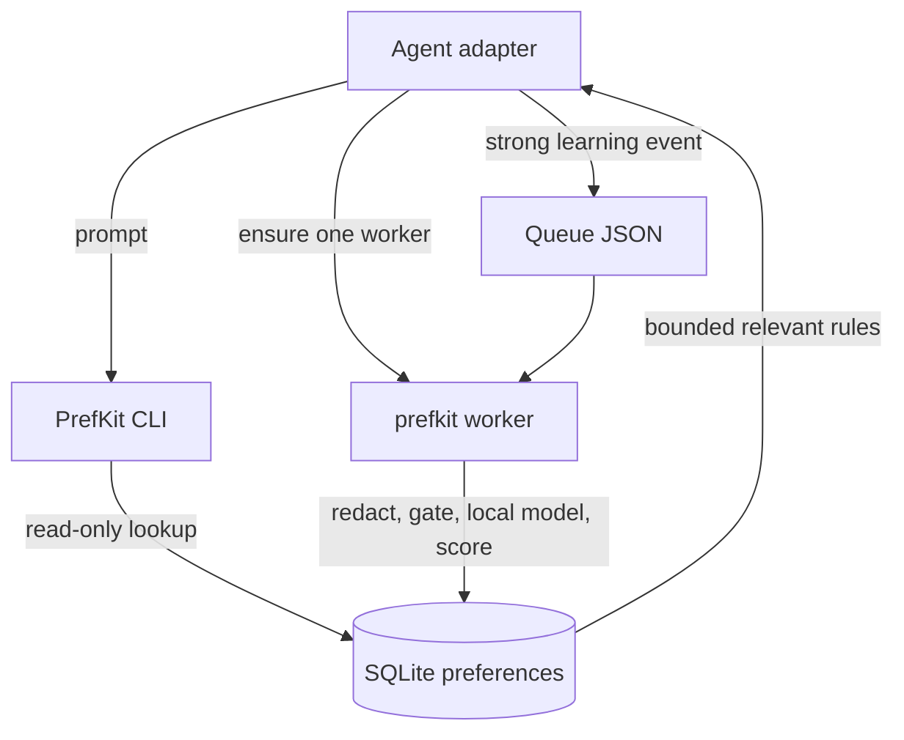

# PrefKit

PrefKit is a local-first **preference memory** layer for coding agents. It stores durable working preferences in SQLite with provenance, retrieves only the ones relevant to a task, and can learn candidates from redacted agent events through a local model.

It is not conversation memory. It stores operational rules — tooling, style, workflow — that you can read, audit, and revoke.

Retrieval is deterministic and never calls a model. Learning is local by default, and the model only *proposes*: code decides status and confidence.

Adapters: **Claude Code**, **Codex**, **OpenCode** (1.18.x and 2.x), plus an **MCP server**. `@prefkit/core` is adapter-agnostic.

## Install

Published:

```bash
npm install --global @prefkit/cli
prefkit init
```

The store defaults to `~/.prefkit/prefs.db`. Learning needs a local [Ollama](https://ollama.com) server; storage and retrieval do not.

From source:

```bash
pnpm install
pnpm typecheck && pnpm test
pnpm prefkit init
```

For isolated checks, point the store elsewhere:

```bash
export PREFKIT_STORE="/tmp/prefkit-check.db"
pnpm prefkit init
```

## Quick start

```bash
prefkit remember "Prefer pnpm for JavaScript projects." --category tooling --tag javascript
prefkit context --prompt "set up a new JS project"
prefkit list
prefkit why <pref_id>
prefkit doctor
```

## Commands

| Command | Purpose |
| --- | --- |
| `init` | Create the store |
| `remember`, `list`, `why` | Store preferences and inspect provenance |
| `pin`, `forget`, `review` | Change status; review learned candidates |
| `context` | Deterministic, read-only retrieval for a prompt |
| `learn`, `replay`, `queue`, `worker` | Learning pipeline (dry-run, replay, enqueue, background worker) |
| `stats`, `evaluate` | Local counters and explicit outcome comparison |
| `export`, `import`, `backup` | Markdown/JSON transfer and SQLite backup |
| `doctor` | Config, store, and model diagnostics |
| `opencode`, `codex` | Adapter `install` and `doctor` |
| `mcp` | Serve the MCP tools over stdio |

## Configuration

Loaded in precedence order, highest first:

1. `--config path` (or `PREFKIT_CONFIG`)
2. environment variables
3. `.prefkit.json` in the current directory
4. `~/.config/prefkit/config.json`

Common variables: `PREFKIT_STORE`, `PREFKIT_LEARNER`, `PREFKIT_OLLAMA_BASE_URL`, `PREFKIT_OLLAMA_MODEL`, `PREFKIT_MODEL_TEMPERATURE`, `PREFKIT_MODEL_TIMEOUT_MS`, `PREFKIT_WORKER_POLL_MS`, `PREFKIT_WORKER_BATCH_SIZE`, `PREFKIT_QUEUE_MAX_ATTEMPTS`, `PREFKIT_REDACT_SECRETS`. See [.prefkit.example.json](.prefkit.example.json) for every setting.

Adapters expect `prefkit` on `PATH`; set `PREFKIT_COMMAND` / `PREFKIT_ARGS` to use a wrapper such as `pnpm`.

## Architecture



```text
~/.prefkit/
  prefs.db                 preferences and evidence
  queue/*.json             pending events and retryable failures
  queue/processed/*.json   successfully handled events
  queue/.worker.lock       single-worker lease
```

- **Retrieval:** prompt -> FTS5 (with lexical fallback) -> scope/confidence filters -> ranked, token-bounded context block.
- **Learning:** event -> schema validation -> redaction -> deterministic signal gate -> local model JSON -> schema validation -> confidence scoring -> optional persistence.
- **Worker:** one process per queue, bounded batches, retry then dead-letter; only the worker writes learned preferences.

## Adapters

- **Claude Code** — `UserPromptSubmit` hooks; sync context injection, async learner queueing. See [docs/claude.md](docs/claude.md).
- **Codex** — hooks when available, with a generated `AGENTS.md` fallback. See [docs/codex.md](docs/codex.md).
- **OpenCode** — V2 `setup()` on 2.x and V1 `server()` hooks on 1.18.x from one entrypoint. See [docs/opencode.md](docs/opencode.md).
- **MCP** — seven annotated tools over stdio for hosts without hooks. See [docs/mcp.md](docs/mcp.md).

Event shape and metadata signals: [docs/events.md](docs/events.md). Model tuning: [docs/model-qa.md](docs/model-qa.md).

## Safety model

- retrieval never calls a model
- learning is local; remote learning is not implemented
- redaction runs before any model call
- model output is schema-validated; model-proposed `active` becomes `candidate`
- deterministic code decides status and confidence
- global preferences require confirmation
- candidates and suppressed rules are not injected
- reusable workflow guidance is separated from one-session task scope

## Limitations

- Adapters capture the **user prompt** only (Claude/Codex `UserPromptSubmit`, OpenCode `chat.message`/prompt hook). There is no assistant-turn capture, so "correction" is prompt-pattern based.
- Learned preferences are **candidates** until reviewed (`prefkit review`) or pinned; forgetting a rule is silent-safe, and re-adding one requires `--reactivate`.
- The context budget uses a `characters / 4` token estimate, not a real tokenizer.
- OpenCode 2.x requires the `plugins` config key and a **directory** entry, and the server must be restarted after config changes; the plugin's CLI calls inherit the server's environment.
- `evaluate` is a descriptive comparison and needs a corpus of explicitly closed sessions to be meaningful.
- No sync, UI, vectors, or daemon.

## Development

```bash
pnpm typecheck        # tsc, strict
pnpm test             # vitest (196 tests)
pnpm build:packages   # dist for publishable packages
```

Tests resolve workspace packages from `src` via `vitest.config.ts` aliases and `tsconfig.base.json` paths. CI runs `typecheck`, `test`, `build:packages`, and `pack --dry-run` for each package.

## License

Apache-2.0. See [LICENSE](LICENSE).
